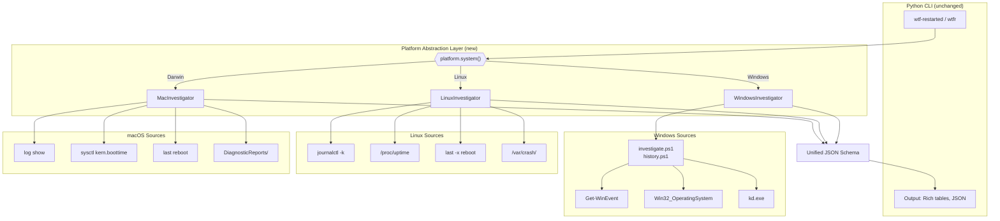

# Platform Support

[](docs/platform-support.md)

## Current Status

**wtf-restarted currently runs on Windows only** (Windows 10 and 11, PowerShell 5.1+).

Linux and macOS support is planned but not yet implemented. The badge above reflects the project's cross-platform goal as part of the [DazzleTools](https://github.com/DazzleTools) ecosystem -- a suite of tools that work everywhere.

## How It Works Today (Windows)

The tool follows a two-layer architecture:

```
Python CLI (argparse + Rich)
    |
    v
PowerShell scripts (investigate.ps1)
    |
    v
Windows Event Logs, CIM/WMI, crash dumps, WTS API
```

### Windows-Specific Dependencies

| Component | What It Uses | Purpose |
|-----------|-------------|---------|
| **Event log queries** | `Get-WinEvent` (PowerShell cmdlet) | Read System and Application event logs |
| **System info** | `Get-CimInstance Win32_OperatingSystem` | Boot time, OS version |
| **Elevation check** | `WindowsPrincipal` / `WindowsIdentity` (.NET) | Detect admin privileges |
| **Crash dumps** | `C:\Windows\MEMORY.DMP`, `C:\Windows\Minidump\` | BSOD memory dump files |
| **Dump analysis** | `kd.exe` (Windows SDK Debugger) | Parse bugcheck codes from crash dumps |
| **RDP detection** | `$env:SESSIONNAME`, `query session` | Detect Remote Desktop sessions |
| **Restart history** | Event IDs 6005, 6006, 6008, 1074 | Boot/shutdown lifecycle events |
| **WHEA errors** | `Microsoft-Windows-WHEA-Logger` provider | Hardware fault detection |
| **GPU events** | Event IDs 4101, 4097, `nvlddmkm` provider | Display driver TDR/recovery |

For why the tool uses both PowerShell and Python (and what each layer is responsible for), see [powershell-engine.md](powershell-engine.md#why-powershell).

## Future: Cross-Platform Abstraction

The general concept -- "why did my machine restart?" -- applies to every OS. The data sources differ, but the questions are the same:

| Question | Windows Source | Linux Source | macOS Source |
|----------|---------------|-------------|-------------|
| When was last boot? | `Win32_OperatingSystem` | `/proc/uptime`, `uptime -s` | `sysctl kern.boottime` |
| Was shutdown clean? | Event 6005/6006/6008 | `last -x shutdown reboot` | `last reboot`, `log show` |
| Who initiated restart? | Event 1074/1076 | `/var/log/auth.log`, `journalctl` | `log show --predicate` |
| Kernel panic/BSOD? | Crash dumps, WER events | `/var/crash/`, `dmesg`, `journalctl -k` | `/Library/Logs/DiagnosticReports/`, `log show` |
| Hardware errors? | WHEA-Logger events | `mcelog`, `rasdaemon`, `dmesg` | `system_profiler`, `log show` |
| Package/update activity? | WindowsUpdateClient events | `apt`/`dnf`/`pacman` logs, `journalctl` | `softwareupdate --history`, `install.log` |
| GPU driver issues? | Event 4101/4097, nvlddmkm | `dmesg \| grep -i gpu`, Xorg.log | `system.log`, GPU panic reports |

### Proposed Abstraction

The planned approach is to introduce a platform abstraction layer between the Python CLI and the OS-specific investigation logic:

```
Python CLI (argparse + Rich)          <-- unchanged
    |
    v
Platform abstraction (Python)         <-- new layer
    |
    +-- windows/ (PowerShell scripts, current implementation)
    +-- linux/   (journalctl, /proc, dmesg)
    +-- darwin/  (log show, sysctl, DiagnosticReports)
```



Each platform backend would implement a common interface:

```python
class PlatformInvestigator:
    """Abstract base for platform-specific investigation."""

    def get_system_info(self) -> dict:
        """Boot time, uptime, OS version, hostname."""
        ...

    def check_elevation(self) -> bool:
        """Whether the current user has sufficient privileges."""
        ...

    def collect_evidence(self, lookback_hours: int) -> dict:
        """Gather shutdown/crash/hardware evidence."""
        ...

    def get_restart_history(self, days: int) -> list[dict]:
        """Enumerate past restart events."""
        ...

    def analyze_crash_dump(self, dump_path: str) -> dict:
        """Parse crash dump if available."""
        ...
```

### What Would Change

- **`investigator.py`** would detect the platform and delegate to the appropriate backend
- **`history.py`** would similarly dispatch per-platform
- **`investigate.ps1`** stays as-is (the Windows backend)
- New Linux/macOS backends would be pure Python (using `subprocess` for `journalctl`, `dmesg`, `log show`, etc.)
- **Verdicts remain the same** -- BSOD becomes "Kernel Panic" on Linux/macOS, but the categories (unexpected shutdown, initiated restart, clean restart) are universal

### What Stays the Same

- CLI interface and all flags
- Output format (Rich tables, JSON mode)
- Verdict types and color coding
- The core question: "WTF happened to my machine?"

## Contributing Platform Support

If you're interested in adding Linux or macOS support, the key steps are:

1. Implement `PlatformInvestigator` for your OS
2. Map OS-specific events to the existing evidence categories
3. Ensure `--json` output matches the current schema
4. Add platform detection in `investigator.py`

See [CONTRIBUTING.md](../CONTRIBUTING.md) for general contribution guidelines.
