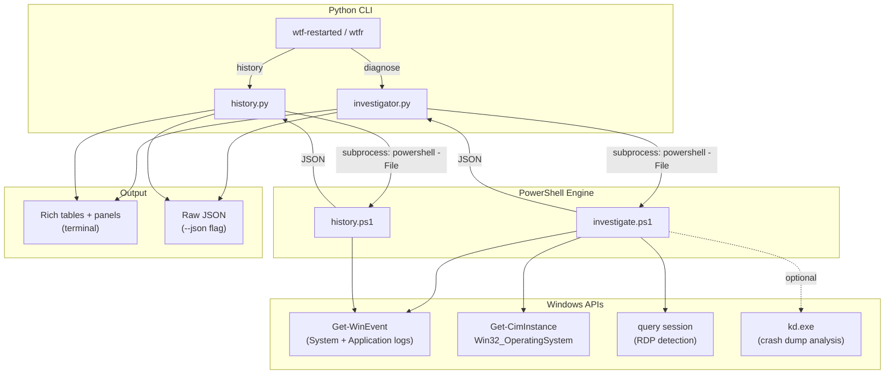

# PowerShell Engine

wtf-restarted is a Python CLI that orchestrates PowerShell scripts underneath. You don't need Python to use the investigation engine -- the PowerShell scripts work standalone and can be sourced into your own sessions or scripts.

## Architecture

```
wtf-restarted (Python CLI)
    |
    |  subprocess: powershell -File investigate.ps1 -JsonOnly
    |
    v
investigate.ps1 (PowerShell)
    |
    +-- Get-WinEvent (System, Application logs)
    +-- Get-CimInstance Win32_OperatingSystem
    +-- query session (RDP detection)
    +-- kd.exe (crash dump analysis, optional)
    |
    v
Structured JSON --> Python renders with Rich
```



The Python layer handles argument parsing, pretty output (Rich tables and panels), and the `history` subcommand. The PowerShell script does all the actual investigation work.

### Why PowerShell?

The investigation engine is written in PowerShell rather than pure Python because:

1. **Direct access to Windows Event Logs** -- `Get-WinEvent` is the standard tool, with filtering by provider, ID, and time range built in
2. **No extra dependencies** -- PowerShell 5.1 ships with Windows 10/11
3. **CIM/WMI integration** -- system information queries are one-liners
4. **Crash dump analysis** -- `kd.exe` is a native Windows debugger; PowerShell can invoke it and parse the output naturally

### Why Python on top?

If PowerShell does all the heavy lifting, why not ship the PS1 by itself?

1. **Rich terminal output** -- PowerShell's `Write-Host` gives you colored text, but not tables, panels, progress bars, or responsive layouts. Rich does all of that out of the box.
2. **`pip install` distribution** -- one command installs the tool, registers `wtf-restarted` and `wtfr` as commands, and bundles the PS1 scripts. No manual PATH setup, no copying files around.
3. **Cross-platform future** -- when Linux and macOS backends are added, Python is the natural dispatch layer. The CLI stays the same; only the backend changes per OS. PowerShell alone can't provide that.
4. **JSON post-processing** -- Python handles the structured JSON from PowerShell, merges results, and decides what to display based on `--verbose`, `--json`, etc. Doing this formatting logic in PowerShell would be fragile and hard to test.
5. **Testability** -- pytest can exercise the CLI, argument parsing, rendering logic, and JSON handling without touching event logs. The PS1 scripts are tested by running them on real Windows systems.

In short: PowerShell is better at talking to Windows. Python is better at everything around it -- packaging, output, testing, and future portability.

## Using investigate.ps1 Directly

The script lives at `wtf_restarted/ps1/investigate.ps1` inside the installed package. You can also grab it from the repo and run it standalone -- it has no dependencies beyond PowerShell 5.1 and Windows.

### Parameters

| Parameter | Type | Default | Description |
|-----------|------|---------|-------------|
| `-LookbackHours` | int | 48 | How far back to search event logs |
| `-StrictLookback` | switch | off | Use exact lookback window (don't auto-extend to cover last restart) |
| `-ContextMinutes` | int | 10 | Minutes of surrounding events to capture before the restart |
| `-SkipDump` | switch | off | Skip crash dump analysis (faster) |
| `-JsonOnly` | switch | off | Output only compact JSON (no human-readable text) |
| `-DumpFile` | string | auto-detect | Specific crash dump file to analyze |
| `-SymbolPath` | string | MS symbol server | Symbol path for kd.exe dump analysis |

### Examples

```powershell
# Basic investigation with human-readable output
powershell -File investigate.ps1

# JSON only (what the Python CLI consumes)
powershell -File investigate.ps1 -JsonOnly

# Look back 72 hours, skip dump analysis
powershell -File investigate.ps1 -LookbackHours 72 -SkipDump

# Analyze a specific dump file
powershell -File investigate.ps1 -DumpFile "C:\Windows\Minidump\091124-12345-01.dmp"

# From an elevated PowerShell prompt (recommended)
powershell -ExecutionPolicy Bypass -File investigate.ps1 -JsonOnly
```

### Output Modes

**Without `-JsonOnly`** (default): prints a human-readable report to the console, followed by a `--- JSON OUTPUT ---` section with the full JSON.

**With `-JsonOnly`**: outputs only compact JSON to stdout, suitable for piping:

```powershell
# Pipe to jq
powershell -File investigate.ps1 -JsonOnly | jq .verdict

# Save to file
powershell -File investigate.ps1 -JsonOnly > last-restart.json

# Use in another script
$data = powershell -File investigate.ps1 -JsonOnly | ConvertFrom-Json
$data.verdict.type  # "BSOD", "UNEXPECTED_SHUTDOWN", etc.
```

## Dot-Sourcing for Interactive Use

You can dot-source the script to get its helper functions in your PowerShell session. This is useful for building your own investigation snippets or integrating into larger scripts.

```powershell
# Dot-source the script (runs the full investigation as a side effect)
. .\investigate.ps1 -SkipDump -JsonOnly | Out-Null

# Now you have the helper functions available:

# Format any event log entry as a hashtable
$events = Get-WinEvent -FilterHashtable @{LogName='System'; Id=41} -MaxEvents 3
$events | ForEach-Object { Format-Event $_ }

# Truncate long strings safely
Truncate-Message "Very long error message..." -MaxLen 80
```

Note that dot-sourcing runs the entire script. If you only want the functions without running the investigation, you'd need to extract them. A future version may split these into a separate module.

### Available Functions

| Function | Purpose |
|----------|---------|
| `Truncate-Message` | Safely truncate a string to a max length, appending `...` |
| `Format-Event` | Convert a `System.Diagnostics.Eventing.Reader.EventLogRecord` to a hashtable with `time`, `id`, `provider`, `message` keys |

## JSON Output Schema

The JSON output has this structure (all fields are always present):

```json
{
  "system": {
    "current_time": "2026-03-11 16:42:10",
    "boot_time": "2026-03-11 04:42:10",
    "uptime_seconds": 43200,
    "uptime_display": "0.12:00:00",
    "lookback_hours": 48,
    "lookback_extended": false,
    "lookback_actual_hours": 48.0,
    "strict_lookback": false,
    "os_version": "Microsoft Windows NT 10.0.26200.0",
    "computer_name": "HAPPYBOX"
  },
  "rdp": {
    "is_rdp": false,
    "session_name": "Console",
    "disconnected_sessions": [],
    "warning": null
  },
  "evidence": {
    "dirty_shutdown": false,
    "bugcheck": false,
    "initiated_by": null,
    "whea_error": false,
    "windows_update": false,
    "crash_dump_exists": false,
    "previous_uptime": null
  },
  "verdict": {
    "type": "CLEAN_RESTART",
    "summary": "No evidence of unexpected shutdown. Most recent restart was clean.",
    "details": []
  },
  "events": {
    "kernel_power_41": [],
    "event_6008": [],
    "shutdown_initiator": [],
    "power_transitions": [],
    "bugcheck": [],
    "whea": [],
    "windows_update": [],
    "app_crashes": [],
    "boot_sequence": [],
    "context_window": [],
    "gpu_events": []
  },
  "dumps": {
    "memory_dmp": null,
    "minidumps": [],
    "recent_dumps": []
  },
  "dump_analysis": {
    "performed": false,
    "dump_file": null,
    "kd_available": false,
    "bugcheck_code": null,
    "module": null,
    "image": null,
    "symbol": null,
    "process": null,
    "bucket": null,
    "raw_output": null
  },
  "previous_boot": {}
}
```

### Verdict Types

| `verdict.type` | Meaning |
|-----------------|---------|
| `BSOD` | Blue Screen -- crash dump or bugcheck event with dirty shutdown |
| `UNEXPECTED_SHUTDOWN` | Dirty shutdown, no initiator (power loss, hardware reset) |
| `INITIATED_RESTART` | A process requested the restart (often Windows Update) |
| `MIXED_SIGNALS` | Both dirty shutdown and restart initiator found |
| `CLEAN_RESTART` | Normal, expected restart |

### Event Entry Format

Each event in the `events` arrays follows this shape:

```json
{
  "time": "2026-03-11 04:40:15",
  "id": 1074,
  "provider": "User32",
  "message": "The process C:\\Windows\\system32\\svchost.exe has initiated the restart..."
}
```

Some event types add extra fields:
- `boot_sequence` entries include `"label"`: `"START"`, `"CLEAN_STOP"`, `"DIRTY_SHUTDOWN"`, or `"OS_VERSION"`
- `windows_update` entries include `"near_crash"`: `true`/`false`

## Integration Ideas

Since the PowerShell script outputs structured JSON, you can integrate it into other workflows:

```powershell
# Scheduled task: log restart reasons to a file
$json = powershell -File investigate.ps1 -JsonOnly
$entry = @{
    timestamp = Get-Date -Format "yyyy-MM-dd HH:mm:ss"
    verdict = ($json | ConvertFrom-Json).verdict.type
    raw = $json
}
$entry | ConvertTo-Json | Add-Content "C:\Logs\restart-history.jsonl"
```

```powershell
# Alert on unexpected shutdowns
$result = powershell -File investigate.ps1 -JsonOnly | ConvertFrom-Json
if ($result.verdict.type -in @("BSOD", "UNEXPECTED_SHUTDOWN")) {
    Send-MailMessage -To admin@example.com -Subject "Unexpected restart on $env:COMPUTERNAME" `
        -Body $result.verdict.summary -SmtpServer smtp.example.com
}
```

```powershell
# Feed to AI for deeper analysis
$json = powershell -File investigate.ps1 -JsonOnly
$json | claude "Analyze this Windows restart report and explain what happened in plain language"
```
